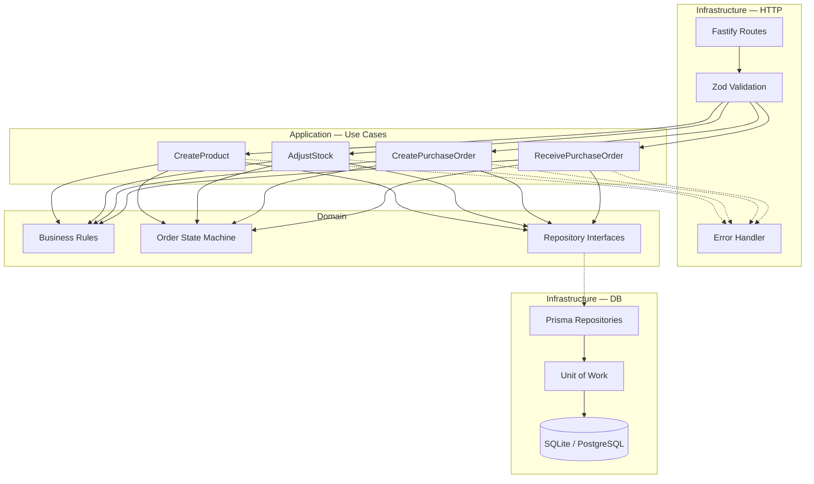
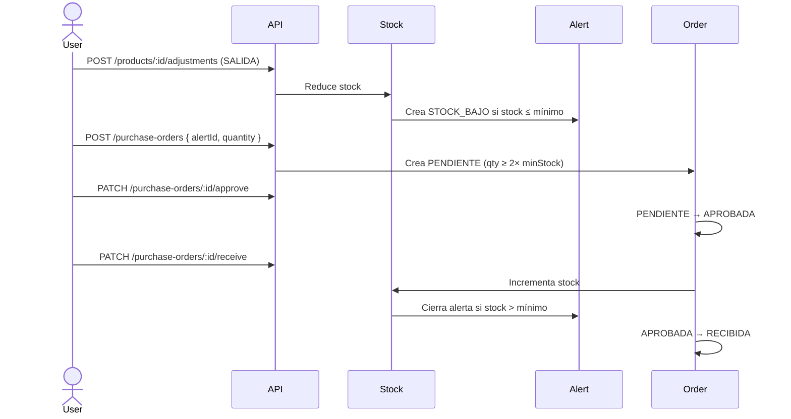

# Inventory Management API — MercadoExpress

API REST para gestión de inventario, alertas de stock bajo y órdenes de compra.

**Demo en vivo:** _Pendiente de deploy — ver sección [Deploy](#deploy-en-la-nube)_

**Repositorio:** [github.com/jsvargasrr/inventory-management-api-node](https://github.com/jsvargasrr/inventory-management-api-node)

---

## Stack tecnológico

| Capa | Tecnología |
|------|------------|
| Runtime | Node.js 20+ |
| Lenguaje | TypeScript (strict) |
| HTTP | Fastify 5 |
| ORM | Prisma |
| Base de datos | SQLite (local) / PostgreSQL (producción) |
| Validación | Zod |
| Tests | Vitest + `app.inject` |
| Docs | Swagger UI en `/docs` |
| CI | GitHub Actions |
| Deploy | Docker · Render · Railway |

---

## Arquitectura

Se implementó **Clean Architecture (Hexagonal)** — las reglas de negocio no dependen de Fastify ni Prisma.

### Diagrama de capas



### Estructura de carpetas

```
src/
├── domain/           # Entidades, reglas, interfaces (ports)
├── application/      # Casos de uso
├── infrastructure/   # Prisma, Fastify, Swagger
├── shared/errors/    # Errores de dominio
└── composition-root.ts
```

### Justificación de decisiones

| Decisión | Alternativa descartada | Por qué esta |
|----------|------------------------|--------------|
| Clean Architecture | MVC plano | Reglas testeables sin DB; evalúan diseño |
| Fastify | NestJS | Control arquitectónico propio, menos magia |
| Prisma | MongoDB | Modelo relacional + transacciones ACID |
| SQLite local | Solo in-memory | Migraciones reales, seed persistente |
| Vitest | Jest | Más rápido, ESM nativo |
| Zod | class-validator | Sin decorators, inferencia de tipos |

### Flujo: orden de compra completa



---

## Requisitos previos

- Node.js >= 20
- npm >= 10

## Instalación y ejecución

```bash
git clone https://github.com/jsvargasrr/inventory-management-api-node.git
cd inventory-management-api-node

npm install
cp .env.example .env

npm run db:generate
npm run db:deploy
npm run db:seed

npm run dev
```

| Recurso | URL |
|---------|-----|
| API | http://localhost:3000 |
| Swagger | http://localhost:3000/docs |
| Health | http://localhost:3000/health |

---

## Ejemplos con curl

### 1. Health check

```bash
curl http://localhost:3000/health
```

### 2. Listar productos con alerta activa

```bash
curl "http://localhost:3000/products?hasActiveAlert=true"
```

### 3. Crear producto

```bash
curl -X POST http://localhost:3000/products \
  -H "Content-Type: application/json" \
  -d '{
    "name": "Arroz Premium 1kg",
    "sku": "GRA-001",
    "category": "Granos",
    "price": 3500,
    "currentStock": 100,
    "minStock": 30,
    "supplier": "Granos del Norte"
  }'
```

### 4. Ajustar stock (salida — provoca error si no hay suficiente)

```bash
# Sustituir :id por UUID del producto
curl -X POST http://localhost:3000/products/{id}/adjustments \
  -H "Content-Type: application/json" \
  -d '{ "type": "SALIDA", "quantity": 10, "reason": "Venta mostrador" }'
```

### 5. Ver historial de movimientos

```bash
curl http://localhost:3000/products/{id}/movements
```

### 6. Listar alertas activas

```bash
curl "http://localhost:3000/alerts?status=ACTIVA"
```

### 7. Crear orden desde alerta

```bash
curl -X POST http://localhost:3000/purchase-orders \
  -H "Content-Type: application/json" \
  -d '{ "alertId": "{alert-uuid}", "quantity": 50 }'
```

### 8. Ciclo de vida de orden

```bash
curl -X PATCH http://localhost:3000/purchase-orders/{id}/approve

curl -X PATCH http://localhost:3000/purchase-orders/{id}/reject \
  -H "Content-Type: application/json" \
  -d '{ "reason": "Presupuesto no disponible este mes" }'

curl -X PATCH http://localhost:3000/purchase-orders/{id}/receive
```

---

## Scripts disponibles

| Script | Descripción |
|--------|-------------|
| `npm run dev` | Servidor con hot-reload |
| `npm run build` | Compilar TypeScript |
| `npm start` | Ejecutar build de producción |
| `npm run start:prod` | Producción con migrate + seed |
| `npm test` | 53 tests automatizados |
| `npm run test:coverage` | Reporte de cobertura (~86%) |
| `npm run verify:enunciado` | Checklist RF + 6 reglas (27 checks) |
| `npm run db:deploy` | Aplicar migraciones |
| `npm run db:seed` | Datos de referencia |
| `npm run lint` | ESLint |
| `npm run format` | Prettier |

---

## Endpoints

### Productos

| Método | Ruta | Descripción |
|--------|------|-------------|
| `POST` | `/products` | Registrar producto |
| `GET` | `/products` | Listar con filtros |
| `GET` | `/products/:id` | Obtener producto |
| `POST` | `/products/:id/adjustments` | Ajustar stock |
| `GET` | `/products/:id/movements` | Historial inmutable |

**Filtros:** `category`, `supplier`, `hasActiveAlert`, `minStock`, `maxStock`

### Alertas

| Método | Ruta | Descripción |
|--------|------|-------------|
| `GET` | `/alerts` | Listar (`status`, `productId`) |

### Órdenes de compra

| Método | Ruta | Descripción |
|--------|------|-------------|
| `POST` | `/purchase-orders` | Crear (manual o desde alerta) |
| `GET` | `/purchase-orders` | Listar |
| `GET` | `/purchase-orders/:id` | Obtener |
| `PATCH` | `/purchase-orders/:id/approve` | PENDIENTE → APROBADA |
| `PATCH` | `/purchase-orders/:id/reject` | PENDIENTE → RECHAZADA |
| `PATCH` | `/purchase-orders/:id/receive` | APROBADA → RECIBIDA |

---

## Reglas de negocio

| # | Regla | Código HTTP |
|---|-------|-------------|
| 1 | Stock no negativo (con `shortfall`) | 422 |
| 2 | Orden mínima = 2× stock mínimo | 422 |
| 3 | Cierre automático de alertas | — |
| 4 | Una alerta ACTIVA por producto | — |
| 5 | Solo PENDIENTE → aprobar/rechazar | 422 |
| 6 | Historial inmutable | 404 |

---

## Seguridad

- `@fastify/helmet` — headers HTTP seguros
- `@fastify/rate-limit` — 100 req/min en producción
- `bodyLimit` — 1 MB máximo
- Errores 500 sin stack trace en producción

---

## Tests

```bash
npm test
npm run test:coverage
npm run verify:enunciado
```

| Métrica | Valor |
|---------|-------|
| Tests | 53 |
| Cobertura statements | ~86% |
| Cobertura functions | ~92% |
| Checklist enunciado | 27/27 ✅ |

---

## Docker

```bash
docker compose up --build
```

Levanta PostgreSQL + API en http://localhost:3000

---

## CI

GitHub Actions (`.github/workflows/ci.yml`): lint → build → test → verify:enunciado

---

## Deploy en la nube

### Render (recomendado — 5 minutos)

1. Ir a [render.com](https://render.com) → **New Blueprint**
2. Conectar repo `jsvargasrr/inventory-management-api-node`
3. Render lee `render.yaml` y crea Web Service + PostgreSQL
4. Tras el deploy, copiar la URL y actualizar esta línea del README:

```
Demo en vivo: https://TU-SERVICIO.onrender.com
```

### Railway

1. [railway.app](https://railway.app) → New Project → Deploy from GitHub
2. Añadir plugin **PostgreSQL**
3. Variable `DATABASE_URL` se vincula automáticamente
4. Railway usa `Dockerfile` + `railway.toml`

### Actualizar URL en README

Tras deploy exitoso, verificar:

```bash
curl https://TU-URL.onrender.com/health
curl https://TU-URL.onrender.com/docs
```

---

## Checklist de entrega

| Entregable | Estado |
|------------|--------|
| Repositorio GitHub público | ✅ |
| README con arquitectura e instrucciones | ✅ |
| Tests automatizados (53) | ✅ |
| Cumplimiento RF-01 a RF-06 | ✅ |
| 6 reglas de negocio | ✅ |
| Seed con datos del enunciado | ✅ |
| URL deployada en nube | ⏳ Pendiente |

---

## Datos de referencia (seed)

6 productos del enunciado. Con alerta activa automática:

- **LAC-002** Yogur — stock 15, mín 25
- **BEB-002** Jugo — stock 30, mín 40

Categorías: Bebidas, Lácteos, Snacks, Limpieza, Frutas, Granos

---

## Autor

Prueba técnica — Sistema de Gestión de Inventario MercadoExpress
